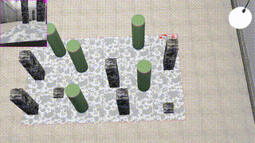

# Aerial Robotics 
Exercises and the major software project using a Crazyflie implemented in Webots for the MICRO-502 Aerial Robotics course. The objective is to traverse the map as fast as possible, land, take off and race back to the other side.

Your can find the documentation here.
**Documentation:** https://micro-502.readthedocs.io

This is my final result

